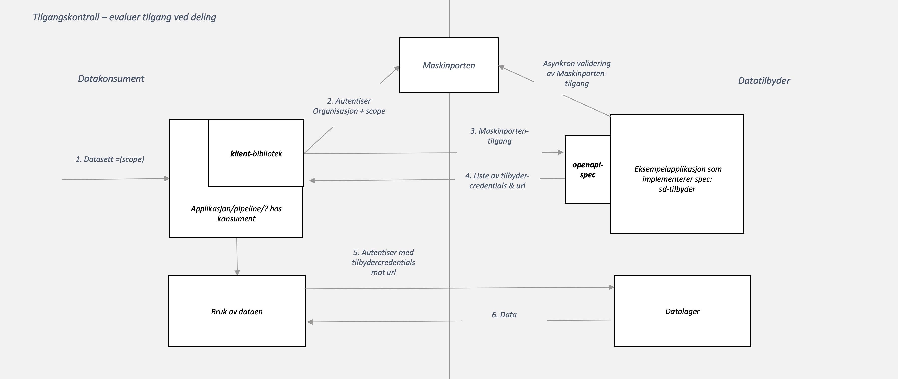
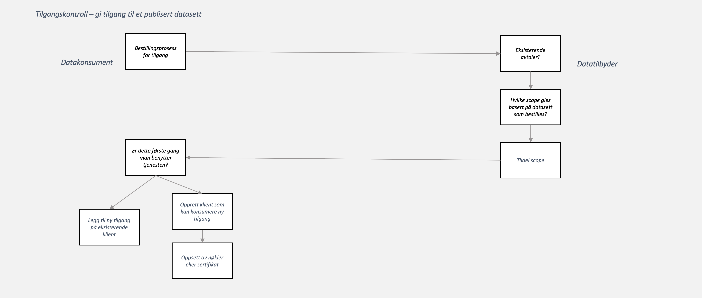

# Tverrsektorielt datasamarbeid - eksempel på tilbyderkomponent

Prosjektet ønsker å tilby *enkel og nyttig datadeling på tvers av av virksomhetene i samferdselssektoren*. Prosjektet tar likevel sikte på at 
dataen som deles eller mekanismene man bruker begrenser bruke og nytte til kun samferdselssektoren. 

Virksomhetene i prosjektet har i fellesskap utelukket felles lagring og felles analyseløsninger som en del av løsningsforslaget. 

Denne komponenten tar sikte på seg å adressere en måte å løse distribuert tilgangsstyring uten å innføre nye felleskomponenter utenfor 
virksomhetenes infrastruktur.

## Hypotesene som ligger bak valgene i denne komponenten

Disse hypotesene ble definert i forkant av utviklingsarbeidet og komponenten forsøker å svare ut følgende:

* Maskinpålogging for et gitt formål kan holde som pålogging
* Tilgangsstyringen kan legges oppå flere delingsmekanismer slik at virksomhetene ikke trenger å standardisere hvordan man deler
* Informasjon fra påloggingstoken kan brukes for å mappe interne servicebrukere som styrer tilgang 
* Mappingen i 3. er en myk avtale og dette holder som sikkerhetsmekanisme

## Beskrivelse av flyt

### Aksessere tilgangsstyrt data



### Bestille tilgang som konsument



### Nye tilbydere

Tilbydere må følge [open-api-specen](src/main/resources/specs/resolve-1.0.0.yaml). For bedre lesbarhet, kopier innholdet inn i https://editor.swagger.io.

### Max-grense på http-headers

Bør sesttes til 8Kb. Dette er default via Tomcat i Spring Boot. 

## Utvikling 

For å kjøre opp denne applikasjonen trengs følgende konfigurasjon i application.yml:
 
```
saKey: "${DIN_ENV_VARIABLE}"
```

Her forutsettes det at det er en Google Service Account private key. 

### Nytt datasett

Et nytt datasett må få et nytt scope opprettet i Maskinporten under Entur. Deretter må man gjøre følgende

* Scopet inn som gyldig i `SecurityConfig`
* Scopet må få en ny `Scope`-enum
* Scopet må få en ny `*Distribution`-klasse som implementerer `ScopeToDistribution`
* Ny service-account må opprettes som kun har tilgang til de aktuelle datasettene som skal deles


## Testing

Kjøring av integrasjontestene trenger i tillegg følgende properties for å hente ut et gyldig maskinportentoken

```
MPORTEN_TOKENENDPOINT=url til tokenendpoint for maskinporten
MPORTEN_USERNAME=brukernavn
MPORTEN_PASSWORD=passord
```